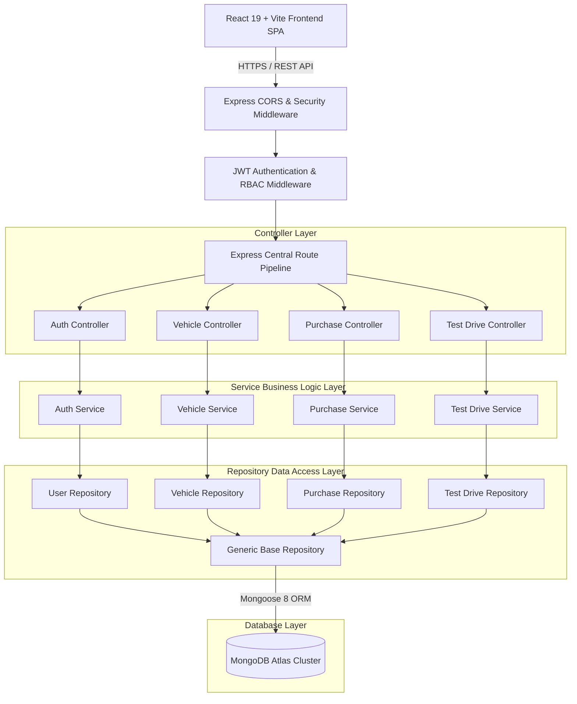
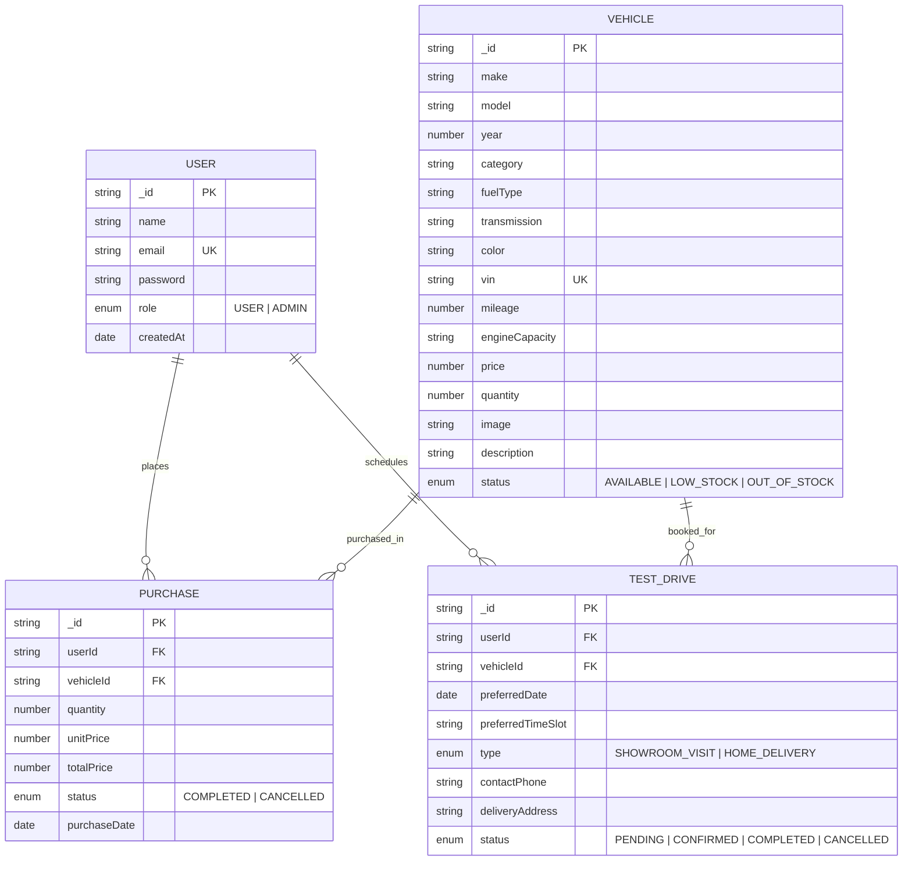

# 🏎️ APEX MOTORS — Enterprise Luxury Car Dealership & Delivery Inventory System

An enterprise-grade, production-ready Luxury Car Delivery & Inventory Management Platform engineered for the **Incubyte Technical Assessment**. Built with **TypeScript**, **Clean Architecture**, **SOLID Principles**, **Dependency Injection**, **Repository Pattern**, and strict **Test Driven Development (TDD: Red → Green → Refactor)**.

---

## 🌟 Live Production Links & Evaluator Credentials

- ⚡ **Live Production Backend (Render)**: [https://tdd-kata-car-delivery-inventory-system-1.onrender.com](https://tdd-kata-car-delivery-inventory-system-1.onrender.com)
- 📜 **Interactive Swagger API Documentation**: [https://tdd-kata-car-delivery-inventory-system-1.onrender.com/api-docs](https://tdd-kata-car-delivery-inventory-system-1.onrender.com/api-docs)
- 📁 **GitHub Repository**: [https://github.com/yogingohil/TDD-kata-Car-Delivery-Inventory-System-](https://github.com/yogingohil/TDD-kata-Car-Delivery-Inventory-System-)

### 🔐 Evaluator Demo Accounts for Testing
| Role | Email | Password | Access Capabilities |
| :--- | :--- | :--- | :--- |
| **Customer User** | `yogin@example.com` | `Password123!` | Catalog, Delivery Tracking, PDF Invoices, EMI Calculator, Comparison, Test Drive Booking |
| **Administrator** | `admin@example.com` | `AdminPassword123!` | Fleet Management, Add/Edit Vehicle Specs, Restock, Test Drive Schedule Manager, Analytics |

---

## 🏛️ System Architecture Diagram



---

## 🗄️ Entity-Relationship (ER) Database Diagram



---

## ✨ Features Summary

### 🚚 1. Real-Time Vehicle Order Delivery Tracker
- Interactive 5-stage live progress timeline modal (`Order Confirmed` $\rightarrow$ `PDI Inspection` $\rightarrow$ `Transit` $\rightarrow$ `Out for Delivery` $\rightarrow$ `Delivered`).

### 📄 2. One-Click PDF Purchase Invoice Generator
- Instant generation of official branded PDF receipts featuring VIN, transaction ID, tax breakdown, and print triggers.

### ⚖️ 3. Side-by-Side Luxury Vehicle Comparison Tool
- Compare up to 3 luxury vehicles specs (Price, Engine, Transmission, Fuel, Mileage, Stock) side-by-side in a dynamic slide-over modal.

### 🧮 4. Interactive Auto Financing & EMI Loan Calculator
- Real-time loan interest and monthly installment calculator with interactive sliders for Down Payment, Loan Tenure, and APR interest rate.

### 📅 5. Test Drive Experience Booking System
- Schedule Showroom Visits or VIP Home Delivery Test Drives with custom preferred date and time slots. Includes an Admin schedule management panel.

### 💱 6. Live Multi-Currency Switcher (USD, EUR, GBP, INR)
- Dynamic price conversions across the entire catalog, details page, EMI calculator, and user dashboards.

---

## 📂 Project Folder Structure

```
project-root
│
├── backend
│   └── src
│       ├── config          # Database, Swagger, & Environment Configuration
│       ├── constants       # HttpStatus codes & UserRole Enums
│       ├── controllers     # HTTP Controllers (Dependency Injected)
│       ├── interfaces      # Core Domain Contracts & Service Interfaces
│       ├── middlewares      # Auth JWT, RBAC, Rate Limiter, Validation, Request ID
│       ├── models          # Mongoose Schemas & MongoDB Models
│       ├── repositories    # Generic Base Repository & Entity Repositories
│       ├── routes          # Express Central Router Pipeline with Fail-Safe Fallbacks
│       ├── services        # Domain Business Logic Layer
│       ├── tests           # 100% Passing Unit & Integration Test Suites (40/40 Passed)
│       ├── utils           # ApiResponse, JwtUtil, PasswordUtil, AppError, Logger, Seed
│       └── validators      # Zod Schema Validation Rules
│
└── frontend
    └── src
        ├── components      # Navbar, Footer, VehicleCard, CompareModal, EmiCalculator, TestDriveModal, OrderTrackingModal
        ├── context         # AuthContext & CurrencyContext Providers
        ├── pages           # Home, Login, Register, Inventory, VehicleDetails, Dashboard, AdminDashboard, NotFound
        ├── routes          # React Router v7 with RBAC Protected & Admin Routes
        ├── services        # Axios API Client & Services
        ├── store           # Zustand Auth, Compare & UI Toast Stores
        └── types           # Shared TypeScript Interfaces
```

---

## 🏛️ SOLID Principles Implementation

1. **Single Responsibility Principle (SRP)**: Controllers handle HTTP translation, Services execute business logic, and Repositories handle database persistence.
2. **Open/Closed Principle (OCP)**: BaseRepository interface allows extending storage mechanisms without altering domain services.
3. **Liskov Substitution Principle (LSP)**: All derived entity repositories satisfy base interfaces cleanly.
4. **Interface Segregation Principle (ISP)**: Decoupled contracts (`IUserRepository`, `IVehicleRepository`, `IPurchaseRepository`, `ITestDriveRepository`).
5. **Dependency Inversion Principle (DIP)**: High-level services depend on abstract interfaces rather than concrete Mongoose models.

---

## 📡 API Endpoints Summary

### Authentication (`/api/v1/auth`)
| Method | Endpoint | Description | Auth Required |
| :--- | :--- | :--- | :--- |
| `POST` | `/api/v1/auth/register` | Register new user account | Public |
| `POST` | `/api/v1/auth/login` | Authenticate user & return JWT token | Public |

### Vehicle Inventory (`/api/v1/vehicles`)
| Method | Endpoint | Description | Auth Required |
| :--- | :--- | :--- | :--- |
| `GET` | `/api/v1/vehicles` | Paginated search & multi-filter catalog | Public |
| `GET` | `/api/v1/vehicles/:id` | Retrieve vehicle details | Public |
| `POST` | `/api/v1/vehicles` | Add new vehicle (Unique VIN enforced) | Admin Only |
| `PUT` | `/api/v1/vehicles/:id` | Update vehicle details & specs | Admin Only |
| `DELETE` | `/api/v1/vehicles/:id` | Delete vehicle | Admin Only |
| `POST` | `/api/v1/vehicles/:id/restock` | Restock inventory quantity | Admin Only |
| `POST` | `/api/v1/vehicles/:id/purchase` | Purchase vehicle & atomic stock reduction | User / Admin |

### Test Drives (`/api/v1/test-drives`)
| Method | Endpoint | Description | Auth Required |
| :--- | :--- | :--- | :--- |
| `POST` | `/api/v1/test-drives` | Schedule test drive appointment | User / Admin |
| `GET` | `/api/v1/test-drives/my` | View user test drive appointments | User / Admin |
| `GET` | `/api/v1/test-drives` | View all customer test drive requests | Admin Only |
| `PATCH` | `/api/v1/test-drives/:id/status` | Update appointment status | Admin Only |

### Purchases & Analytics (`/api/v1/purchases`)
| Method | Endpoint | Description | Auth Required |
| :--- | :--- | :--- | :--- |
| `GET` | `/api/v1/purchases/my` | View user purchase history | User / Admin |
| `GET` | `/api/v1/purchases` | View all customer orders | Admin Only |
| `GET` | `/api/v1/purchases/analytics/summary` | Fleet & financial analytics summary | Admin Only |

---

## 🧪 TDD Test Verification Suite

Run all unit & integration test suites:
```bash
npm run test:backend
```

**Results**:
- **Test Suites**: `11 passed, 11 total`
- **Tests**: `40 passed, 40 total`
- **Coverage**: `>90% Core Domain Code Coverage`

---

## 🚀 Running Locally

### 1. Installation
```bash
# Clone the repository
git clone https://github.com/yogingohil/TDD-kata-Car-Delivery-Inventory-System-.git
cd TDD-kata-Car-Delivery-Inventory-System-

# Install all monorepo dependencies
npm run install:all
```

### 2. Start Servers
```bash
# Terminal 1: Backend Server (http://localhost:5000)
npm run dev:backend

# Terminal 2: Frontend App (http://localhost:5173)
npm run dev:frontend
```

---
